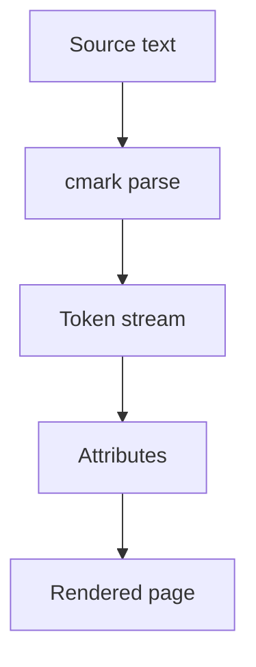

# 1 · Headings 标题

## 2 · Heading with `inline code`

Two hashes above, and this line checks that a heading whose title contains a
code span is still a heading — the old scanner dropped the whole line.

### 3 · Level three

#### 4 · Level four

##### 5 · Level five

###### 6 · Level six

### Closed ATX form ###

Setext level one
================

Setext level two
----------------

---

# 2 · Inline 行内格式

Plain text, then **bold**, __also bold__, *italic*, _also italic_,
***bold italic***, ~~strikethrough~~, ==highlight==, `inline code`,
``code with a ` backtick inside``, and 中英文混排 mixed spacing 测试.

Superscript: E = mc^2^ and 2^10^ = 1024.
Subscript: H~2~O and CO~2~.

Escapes: \*not italic\*, \_not italic\_, \# not a heading, \[not a link\].

Hard line break — two trailing spaces at the end of this line:  
this should be a new line inside the same paragraph.

Soft line break — just a newline:
this should flow into the line above.

Entities: &copy; &amp; &lt; &gt; &hellip; &mdash; &rarr; &#8212; &#x4E2D;

Entities we do not decode stay exactly as written: &fjlig; &notreal;

---

# 3 · Links 链接

Inline link: [Inkstone repository](https://github.com/iamzifei/inkstone)
Link with title: [with a title](https://example.com "the title")
Autolink: <https://example.com>
Bare URL: https://example.com
Email autolink: <someone@example.com>

Wikilink plain: [[Second Note]]
Wikilink with alias: [[Second Note|第二篇笔记]]
Wikilink to a heading: [[Render Test#3 · Links 链接]]
Wikilink to a block: [[Render Test#^target-block]]
Wikilink that does not resolve: [[No Such Note]]

Images take a line of their own, which is how they are written in practice and
the only way the renderer reserves height for them.

Markdown image:


Embedded image:

![[test-image.png]]

Embedded image with a width hint:

![[test-image.png|160]]

Embedded image with an exact box, deliberately not the picture's proportions:

![[test-image.png|200x40]]

Embedded note: ![[Second Note]]
Embed that does not resolve: ![[missing-file.png]]

An image sharing its line with words is drawn as a thumbnail at text size,
rather than as a block: text before ![[test-image.png]] the image. A block image
would be given the whole line's height and painted over those words.

---

# 4 · Lists 列表

Unordered, three markers:

- hyphen item
* asterisk item
+ plus item

Nested, three levels deep:

- level one
  - level two
    - level three
      - level four

Ordered, both delimiters:

1. first
2. second
3. third

1) parenthesis form
2) second

Ordered starting at another number:

7. seven
8. eight

Loose list — note the blank lines between items:

- first paragraph item

- second paragraph item

Task list, GFM states:

- [ ] unchecked task
- [x] checked task
- [X] capital X also counts as done

Task list, Obsidian extended states:

- [/] in progress
- [-] cancelled
- [>] deferred
- [?] question
- [✓] tick pasted from elsewhere

Nested tasks mixed with bullets:

- [ ] top level task
  - [x] nested done task
    - a plain nested bullet
  - [ ] nested open task
- a plain bullet at the top level

---

# 5 · Quotes and callouts 引用与标注

> A single quoted line.

> A quote with two lines
> that wrap together.

> Level one
> > Level two
> > > Level three

> A quote containing other blocks:
>
> - a list inside a quote
> - a second item
>
> ```swift
> let insideAQuote = true
> ```

> [!note] Note callout
> Body of the note callout.

> [!warning] Warning callout
> Body of the warning.

> [!tip] Tip callout
> Body of the tip.

> [!danger] Danger callout
> Body of the danger callout.

> [!question] Question callout
> Body of the question.

> [!example] Example callout
> Body of the example.

> [!quote] Quote callout
> Body of the quote callout.

> [!info]- Folded callout
> This callout is marked folded with a trailing minus.

> [!success]+ Expanded callout
> This callout is marked expanded with a trailing plus.

> [!note]
> A callout with no title at all.

---

# 6 · Code 代码

Fenced with a language:

```swift
struct Inkstone {
    let name = "墨砚"
    // #nottag and [[notlink]] and $notmath$ must stay plain inside code
    func greet() -> String { "Hello, 世界" }
}
```

Fenced with no language:

```
plain fenced block
  preserving   indentation
```

Tilde fences:

~~~python
def greet(name: str) -> str:
    return f"Hello, {name}"
~~~

Indented code block — four spaces, no fence:

    indented code block
    #nottag here either

A Mermaid diagram:



---

# 7 · Tables 表格

Simple:

| Feature | State |
| --- | --- |
| Tables | works |
| Alignment | works |

Alignment — left, centre, right:

| Left | Centre | Right |
|:--- |:---:| ---:|
| a | b | c |
| longer cell | centred | 12.50 |

CJK and mixed-width cells:

| 项目 | 状态 | 说明 |
| --- | --- | --- |
| 表格 | 可以渲染 | 中英 mixed width |
| Latin | fine | 需要对齐 |

Inline syntax inside cells:

| Kind | Example |
| --- | --- |
| bold | **bold text** |
| code | `let x = 1` |
| link | [[Second Note]] |
| tag | #排版 |
| math | $a^2 + b^2$ |
| highlight | ==marked== |

Without the outer pipes — GFM allows this:

Column A | Column B
--- | ---
1 | 2

---

# 8 · Maths 数学

Inline: the identity $e^{i\pi} + 1 = 0$ sits within this sentence, and so does
$\sum_{i=1}^{n} i = \frac{n(n+1)}{2}$.

Block:

$$
\int_{0}^{1} x^2 \, dx = \frac{1}{3}
$$

$$
\begin{aligned}
f(x) &= ax^2 + bx + c \\
f'(x) &= 2ax + b
\end{aligned}
$$

---

# 9 · Tags, footnotes, anchors 标签、脚注、锚点

Simple tag: #design
Nested tag: #design/typography
CJK tag: #中文标签
Tag with digits and dashes: #v2-release

Not tags: issue #1, a #hash in the middle ofaword, `#inline-code-tag`.

A claim needing support[^1], and a named one[^why], and a third[^long].

This paragraph is the target of a block reference. ^target-block

---

# 10 · Rules and breaks 分隔线

Three hyphens:

---

Three asterisks:

***

Three underscores:

___

With spaces between:

- - -

---

# 11 · Comments and HTML 注释与 HTML

An Obsidian comment follows this text %%and this part should be hidden%% and the
sentence continues.

%%
A whole comment block
spanning several lines.
%%

Inline HTML: this is <b>bold via HTML</b> and <em>emphasis via HTML</em>.

An HTML block:

<div align="center">
  <p>Centred HTML block</p>
</div>

---

# 12 · Table of contents 目录

[TOC]

---

# 13 · Negative tests 反例

None of the following should be styled, because they are inside code:

```markdown
# not a heading
- not a bullet
- [ ] not a task
> not a quote
**not bold** *not italic* ==not marked==
[[not a wikilink]] #nottag $not maths$
| not | a table |
| --- | --- |
```

And inline: `**not bold**`, `[[not a link]]`, `#nottag`, `$not maths$`.

A line with a pipe that is not a table: use `a | b` for alternation, or write
a | b inline.

Three hyphens directly under text make a setext heading, not a rule — that is
what section 1 checks.

---

# 14 · CJK typography 中文排版

中文段落里夹杂 Latin words 和 numbers 123，检查盘古之白的渲染时插空是否正确，
并且**不会改动磁盘上的文件**。标点符号：，。、；：？！""''（）《》【】

长段落换行测试：这是一个足够长的中文段落，用来检查在没有空格可以断行的情况下，
排版引擎是否按字符正确断行，而不是把整段推到下一行或者溢出可读宽度之外。

Mixed emphasis in CJK: **中文粗体**、*中文斜体*、~~中文删除线~~、==中文高亮==、
`中文代码`、[[中文链接]]、#中文标签。

Emoji and surrogate pairs: 🌏 🎋 👨‍👩‍👧‍👦 — these are four UTF-8 bytes each and
must not shift the ranges of anything after them: **bold after emoji**.

---

[^1]: The first footnote definition, with several words so that it is not
    mistaken for a CommonMark link reference definition.
[^why]: A named footnote definition.
[^long]: A footnote definition long enough to wrap onto a second line, which
    checks that the continuation is indented like an aside rather than
    returning to the body margin.
