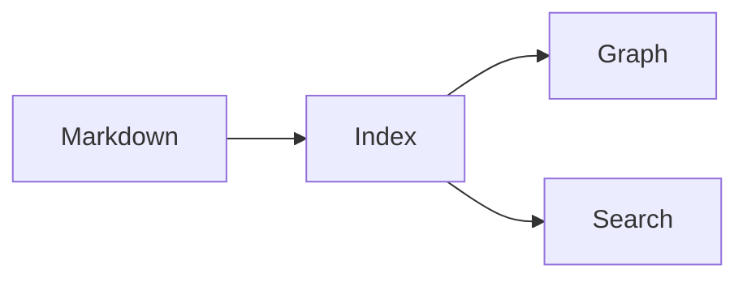

# Inkstone

一个把笔记留成文件的 macOS / iOS 应用。

## 已经做完

- Vault、文件树、外部改动重载
- 双链、别名、块引用、反向链接
- 关系图谱、白板、日记
- iCloud 与 GitHub 同步

## 设计原则

文件才是事实。见 [[Notes/Files as Truth]]。

$E = mc^2$ 这样的行内公式也认。

```mermaid
graph LR
  A[Markdown] --> B[Index]
  B --> C[Graph]
  B --> D[Search]
```
